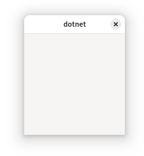
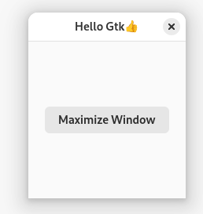
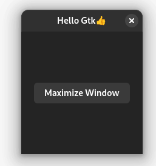

# Gtk4DotNet
C# .NET 8 bindings for GTK4. You can create programs using the GTK4 UI system as a .NET 8 app.

In the following tutorial are (almost) all examples from the original [GTK4 documentation](https://docs.gtk.org/gtk4/getting_started.html) as well as from the [GUI development with Rust and GTK 4](https://gtk-rs.org/gtk4-rs/git/book/), all ported to C#. There is a Test project. In the terminal window, you can choose a certain example to run.

Gtk4DotNet uses a functional declarative approach to GTK4 similar to REACT or Kotlin Compose:

```cs
return Application
    .New("org.gtk.example")
    .OnActivate(app => 
        app
            .NewWindow()
            .Title("Hello Gtk👍")
            .SideEffect(win => win
            .Child(
                Grid
                    .New()
                    .Attach(                                
                        Button
                            .NewWithLabel("Button 1")
                            .OnClicked(() => WriteLine("Button1 clicked")), 
                        0, 0, 1, 1)
                    .Attach(                                
                        Button
                            .NewWithLabel("Button 2")
                            .OnClicked(() => WriteLine("Button2 clicked")), 
                        1, 0, 1, 1)
                    .Attach(                                
                        Button
                            .NewWithLabel("Quit")
                            .OnClicked(() => win.CloseWindow()), 
                        0, 1, 2, 1)))
            .Show())
    .Run(0, 0);
}

```


# Table of contents 
1. [Prerequisites](#prerequisites)
2. [Hello World (a minimal GTK4 app)](#helloworld)
    1. [Fluent syntax](#fluentsyntax)
    2. [Using Adwaita](#adwaita)

## Prerequisites <a name="prerequisites"></a>

### Necessary prerequisites only depending on the version of Linux

On modern Linux like Ubuntu 24.04 or Fedora 40 Gtk4DotNet apps will run out of the box (if you create a full contained single file exe), otherwise you have to install the necessary dotnet runtime.

libadwaita is only necessary if you want to create Adwaita apps, and webkitgtk6 you only need when integrating a webview.

On older/other Linux systems perhaps you have to install one of the following packages in order to make the app runnable. 

``` 
sudo apt install libgtk-4-dev
sudo apt install libadwaita-1-dev
sudo apt install libwebkitgtk-6.0-dev
```

For example on Linux Mint 22 you only have to install 

``` 
sudo apt install libwebkitgtk-6.0-dev
```
if you want to use webkit webview whereas for KDE neon 6.0 you have to install 

``` 
sudo apt install libadwaita-1-dev
sudo apt install libwebkitgtk-6.0-dev
```
### The necessary Gtk4DotNet Nuget package <a name="nuget"></a>

To use these features there is a nuget package  [Gtk4DotNet](https://www.nuget.org/packages/Gtk4DotNet/), which you have to include. 


## Hello World (a minimal GTK4 app) <a name="helloworld"></a>

In a newly created folder create a new console program with .NET (```dotnet new console```). Now add the necessary package: ```dotnet add package Gtk4DotNet```. 

In the created file ```Program.cs``` replace all code with:

```cs 
using GtkDotNet;

static class First
{
    public static int Run()
    {
        var app = Application.New("de.uriegel.first");
        return app.Run(0, 0);
    }
}
```

It creates a GTK45 Application object and then runs the message loop. Compile the program and start it. It starts and ends immediately with the warning:

```GLib-GIO-WARNING **: 08:27:42.149: Your application does not implement g_application_activate() and has no handlers connected to the 'activate' signal.  It should do one of these.```  

When the app is being activated, you have to implement the activate method. You can do this with a injected C# callback with the help of ```Application.OnActivate```. Let's do this:

```cs 
    var app = Application.New("de.uriegel.first");  
    app.OnActivate(app => Console.WriteLine("App is being activated"));
    return app.Run(0, 0);
```     

When you debug the program, OnActivate is being called and returns immediately. When app.Run() is being executed, the injected callback is being called and the text is being displayed in the terminal. However, the app also stops immediately.
Of cource some kind of UI has to be created. 

Let's create a window, this has to be done in the Application.OnActivate callback:

```cs 
app.OnActivate(app =>
{
    var windows = app.NewWindow();
    windows.Show();
});
``` 
Now an empty default window is being shown and the function call ```Applicatio.Run()``` will only return when the window is being closed.

 

### Fluent syntax <a name="fluentsyntax"></a>

To avoid creating many variables only to set them as parameters in a function, Gtk4DotNet uses a functional builder approach to create a complicated ui with fluent syntax. Many setter function returns the same instance, so that builder functions can be assigned in a row.

The above sample can be written using this approach as:

```cs
static class First
{
    public static int Run()
        => Application
            .New("de.uriegel.first")
            .OnActivate(app =>
                app
                    .NewWindow()
                        .Show())
            .Run(0, IntPtr.Zero);
}
```
With this approach the hierarchy of the GTK4 application is being reflected in code.

The Window is very empty. Let's add a title and change the default size:

```cs
    .NewWindow()
        .Title("Hello Gtk👍")
        .DefaultSize(600, 200)
        .Show())
```

Now let's complete our Hello World program with a button and a click handler to maximize the window:

``` 
static class HelloWorld
{
    public static int Run()
        => Application
            .NewAdwaita("org.gtk.example")
            .OnActivate(app =>
                app
                    .SideEffect(_ => WriteLine($"Gkt theme: {GtkSettings.GetDefault().ThemeName}"))
                    .NewWindow()
                    .Title("Hello Gtk👍")
                    .DefaultSize(200, 200)
                    .Pipe(w => w.AddActions(
                        [new GtkAction("quit", () => w.SideEffect(_ => WriteLine("Close window from action")).CloseWindow(), "F4")]))
                    .OnClose(_ => false.SideEffect(_ => WriteLine("Window is closing")))
                    .Pipe(w => w
                        .Child(
                            Box
                                .New(Orientation.Vertical)
                                .HAlign(Align.Center)
                                .VAlign(Align.Center)
                                .Append(
                                    Button
                                        .NewWithLabel("Maximize Window")
                                        .OnClicked(() => w.Maximize())
                                        .Tooltip("This is a sample Button\tCtrl-H"))))

                    .Show())
            .AddActions([new GtkAction("appaction", () => WriteLine("appaction"), "F5")])
            .Run(0, IntPtr.Zero);
}

``` 
Detailed descriptions of the individual steps will follow in later sections.

### Using Adwaita  <a name="adwaita"></a>

The above HelloWorld example has another difference to the first ewample:

``` Application.NewAdwaita("de.uriegel.example")``` 
instead of ``` Application.New("de.uriegel.example")```. Here a new Adwaita window is being created. Adwaita is the design language of the GNOME desktop environment. It exists as the default theme and icon set of the GNOME Shell. When Adwaita is used, you can see a slightly different and more modern look and feel. 

  

One differnce is a big one: as you can see in the images above, the window theme is adapted from the installed and selected Gnome theme. When a dark theme is selected, the window content uses a dark theme as well. This is not the case with a normal GTK Window.

* Application.NewAdwaita creates a new Adw.Window
* This is especially useful with AdwHeaderBar, see later section

## Using Layouts and widgets
### Lambdas in callbacks

 Two convenience functions for extending the fluent syntax are used:
* SideEffect
* Pipe

These functions are from the contained nuget package  [CsTools](https://www.nuget.org/packages/CsTools/).

SideEffect is used to return the input parameter but as it is called, it calls a sideeffect function so that you can do soemthing with the object, e.g. log the object state.

Pipe is similar, but it returns the result of the selector function which is being called on function invocation. This is necessary if you need a variable of the object chained though the function calls. In this example Window.Child is beeing called, but not directly but through the Pipe function so that you get an instance of the window object. It is needed in the following lambda that is used as action callback. A GTK Action is defined and on action the window should be closed so a window instance is needed.

// TODO short explanation of the single steps, especially the callback lambdas


// TODO explain static classes Object and ObjectHandle


## DEPRECATED Part


Contained in this Repo are samples how to use Gtk4DotNet. All examples of the official GTK4 are transformed to C# with Gtk4DotNet.


### If you want to use GTK resources

* sudo apt install libglib2.0-dev-bin

## Installation of GTK Schema
```
    sudo install -D ./Test/org.gtk.example.gschema.xml /usr/share/glib-2.0/schemas/
    sudo glib-compile-schemas /usr/share/glib-2.0/schemas/
```     
## Usage

Look at the sample programs (https://github.com/uriegel/Gtk4DotNet/tree/Main/Test)

## Checking if memory is being freed
To check if GObjects are being freed, just run
```
Widget.AddWeakRef(() => Console.WriteLine("... is being freed));
```
If this object is finalized, then the callback will be called.

